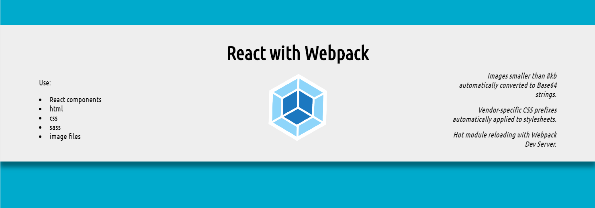

### Basic webpack setup for react

### Notice the webpack.config.js, .bablerc, and package.json for dependencies

### `npm run start` to start the dev server

### `npm run build` to build

### autoprefixer

- type `npx autoprefixer --info` in the project directory to see list of autoprefixer rules
